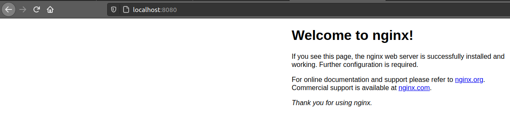

# Run

Docker allows to run images by running the command ```docker run```. If we never downloaded the image that we wan to run before, it will try to download in from the Doker public repository called [Docker Hub](https://hub.docker.com/).

As the concept of a container is an object where runs some isolated application, if we want to consume that application from outside that container we need to do a ports mapping. 

## Docker run

So with the following command we will run a container with the _Nginx_ image and map the 80 container port with the 8080 host port.

```
$docker run -p 8080:80 nginx

/docker-entrypoint.sh: /docker-entrypoint.d/ is not empty, will attempt to perform configuration
/docker-entrypoint.sh: Looking for shell scripts in /docker-entrypoint.d/
/docker-entrypoint.sh: Launching /docker-entrypoint.d/10-listen-on-ipv6-by-default.sh
10-listen-on-ipv6-by-default.sh: info: Getting the checksum of /etc/nginx/conf.d/default.conf
10-listen-on-ipv6-by-default.sh: info: Enabled listen on IPv6 in /etc/nginx/conf.d/default.conf
/docker-entrypoint.sh: Launching /docker-entrypoint.d/20-envsubst-on-templates.sh
/docker-entrypoint.sh: Launching /docker-entrypoint.d/30-tune-worker-processes.sh
/docker-entrypoint.sh: Configuration complete; ready for start up
```

We can check if the container is running by executing the command

```
$ docker ps

CONTAINER ID        IMAGE               COMMAND                  CREATED             STATUS              PORTS                  NAMES
e6f421403424        nginx               "/docker-entrypoint.…"   57 seconds ago      Up 56 seconds       0.0.0.0:8080->80/tcp   elated_albattani
```

Once we have checked that the container is running and the port is mapped correctly, we can check if can access to the application from outside the container. As we are running an _Nginx_ image, we will check if the default website is accessible by using _curl_ or from the browser.
 


```
$ curl localhost:8080

<!DOCTYPE html>
<html>
<head>
<title>Welcome to nginx!</title>
<style>
    body {
        width: 35em;
        margin: 0 auto;
        font-family: Tahoma, Verdana, Arial, sans-serif;
    }
</style>
</head>
<body>
<h1>Welcome to nginx!</h1>
<p>If you see this page, the nginx web server is successfully installed and
working. Further configuration is required.</p>

<p>For online documentation and support please refer to
<a href="http://nginx.org/">nginx.org</a>.<br/>
Commercial support is available at
<a href="http://nginx.com/">nginx.com</a>.</p>

<p><em>Thank you for using nginx.</em></p>
</body>
</html>
```

If the image that we are running has _bash_ installed by default or some other command-line interpreter, we can try to connect to execute some operations. It is possible to do that by executing _Docker_ commands and allows us to run commands inside that container.


```
$ docker run -it nginx sh

# ls
bin  boot  dev	docker-entrypoint.d  docker-entrypoint.sh  etc	home  lib  lib64  media  mnt  opt  proc  root  run  sbin  srv  sys  tmp  usr  var

# curl localhost
curl: (7) Failed to connect to localhost port 80: Connection refused
#
```
Of course, the commands must be installed in the container to be used.

## Docker exec

It is possible to execute operations on a container that is already started and running. We need, like we said before, that the image that is running have some command-line interpreter.

To do so we can check what containers are running on the host machine and take its ID and execute the [```docker exec```](https://docs.docker.com/engine/reference/commandline/exec/) command.

```
$ docker ps

CONTAINER ID        IMAGE               COMMAND                  CREATED             STATUS              PORTS                  NAMES
0228ffc3fa8f        nginx               "/docker-entrypoint.…"   5 seconds ago       Up 4 seconds        0.0.0.0:8080->80/tcp   inspiring_northcutt

$ docker exec -it 0228ffc3fa8f sh

# ls
bin  boot  dev	docker-entrypoint.d  docker-entrypoint.sh  etc	home  lib  lib64  media  mnt  opt  proc  root  run  sbin  srv  sys  tmp  usr  var
```


After this we have installed Docker and tested that it is running correctly. Now we can [continue with this Demo/Lab](../02-Build/README.md).

