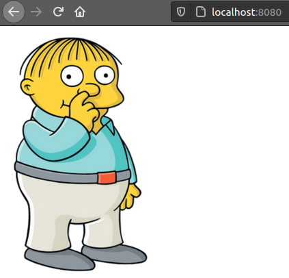

# Build

The Docker images definition is defined as a descriptive file called [_Dockerfile_](https://docs.docker.com/engine/reference/builder/) where the developer should indicate what is the base image to use and what are the different operations to execute over that image.

We can use any other image to generate the new one, and Docker automatically will download the base one as a dependency. It is very important to know the base image that we want to use to optimize as much as possible what the generated image will include. 

## Simple example of Dockerfile and Docker Build

In the following example we will generate a simple image with nginx configured

```
$ cd ralph-nginx

$ docker build -t simpsons:1.0 .

Sending build context to Docker daemon    107kB
Step 1/3 : FROM nginx:alpine
alpine: Pulling from library/nginx
ba3557a56b15: Pull complete 
1a18b9f93d41: Pull complete 
38ceab6c6432: Pull complete 
6104f3bd82cc: Pull complete 
750e0e12d70c: Pull complete 
d7c38a871210: Pull complete 
Digest: sha256:14536d83ca3128923ee7c2f7f4f285e023abd40f3ccdc8911f56cd4119558506
Status: Downloaded newer image for nginx:alpine
 ---> eb9291454164
Step 2/3 : COPY img /usr/share/nginx/html/img/
 ---> 9e4a5f4531c1
Step 3/3 : COPY index.html /usr/share/nginx/html/index.html
 ---> b3f1a505b3b1
Successfully built b3f1a505b3b1
Successfully tagged simpsons:1.0

$ docker images

REPOSITORY          TAG                 IMAGE ID            CREATED              SIZE
simpsons            1.0                 b3f1a505b3b1        About a minute ago   22.7MB
nginx               alpine              eb9291454164        11 days ago          22.6M

$ docker run -p 8080:80 simpsons:1.0

/docker-entrypoint.sh: /docker-entrypoint.d/ is not empty, will attempt to perform configuration
/docker-entrypoint.sh: Looking for shell scripts in /docker-entrypoint.d/
/docker-entrypoint.sh: Launching /docker-entrypoint.d/10-listen-on-ipv6-by-default.sh
10-listen-on-ipv6-by-default.sh: info: Getting the checksum of /etc/nginx/conf.d/default.conf
10-listen-on-ipv6-by-default.sh: info: Enabled listen on IPv6 in /etc/nginx/conf.d/default.conf
/docker-entrypoint.sh: Launching /docker-entrypoint.d/20-envsubst-on-templates.sh
/docker-entrypoint.sh: Launching /docker-entrypoint.d/30-tune-worker-processes.sh
/docker-entrypoint.sh: Configuration complete; ready for start up
```

Now that our image is running, we can try to consume the container in the port 8080 of the host machine.

.

## Builder in Dockerfile

Docker allows to use [multi-stage builds](https://docs.docker.com/develop/develop-images/multistage-build/). This is usually used to compile and generate an artifact in one build and import that artifact to generate the final image.

```
$ cd homer-golang

$ docker build -t homer:1.0 .

Sending build context to Docker daemon  17.41kB
Step 1/7 : FROM golang AS builder
latest: Pulling from library/golang
0ecb575e629c: Pull complete 
7467d1831b69: Pull complete 
feab2c490a3c: Pull complete 
f15a0f46f8c3: Pull complete 
1517911a35d7: Pull complete 
70484a0ec333: Pull complete 
8c0e01d83af9: Pull complete 
Digest: sha256:cbb576bcae3775e8f2a2ddc7012c69044604f8d8dfc031089deb353f5ee7b071
Status: Downloaded newer image for golang:latest
 ---> f15d23d96763
Step 2/7 : COPY * /app/
 ---> ddb89098e2f8
Step 3/7 : WORKDIR /app
 ---> Running in d6951c4486c9
Removing intermediate container d6951c4486c9
 ---> 01a99ded5cb9
Step 4/7 : RUN go build
 ---> Running in 7233d6e92f5d
Removing intermediate container 7233d6e92f5d
 ---> 11508f9f1130
Step 5/7 : FROM golang
 ---> f15d23d96763
Step 6/7 : COPY --from=builder /app ./
 ---> aef5876ac990
Step 7/7 : ENTRYPOINT [ "./homer-golang" ]
 ---> Running in d4b945359fcc
Removing intermediate container d4b945359fcc
 ---> b7bd212d00bd
Successfully built b7bd212d00bd
Successfully tagged homer:1.0

$ docker images

REPOSITORY          TAG                 IMAGE ID            CREATED             SIZE
homer               1.0                 b7bd212d00bd        2 minutes ago       868MB
<none>              <none>              11508f9f1130        2 minutes ago       868MB

$ docker ps

CONTAINER ID        IMAGE               COMMAND             CREATED             STATUS              PORTS                    NAMES
f11fc14e8c69        homer:1.0           "./homer-golang"    4 seconds ago       Up 3 seconds        0.0.0.0:8080->8080/tcp   trusting_poitras

```

We have used a _golang_ container to build a binary file that is copied to a new generated image. Now, that our new container is running we can go to the browser to confirm that is working properly.

.

