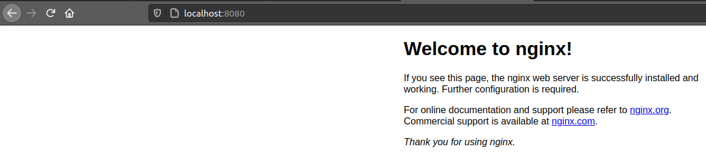

# Pods

In Kubernetes, the [_pods_](https://kubernetes.io/docs/concepts/workloads/pods/) are the mininmum workload type to deploy. It is a group of one or more containers that share the same context like storage or network resources. Each _pod_ is isolated from the other by different Linux namespaces and cgroups so the containers inside the same pod can communicate with each other by calling _localhost_, and this means that the ports for each container must be unique.

## Deploying a Pod

In this first example we will deploy an _nginx_ _pod_ by using the kubectl command.

```
$ kubectl run --generator=run-pod/v1 nginx --image=nginx --namespace=container-lab-ns

pod/nginx created

$ kubectl get pods -n container-lab-ns

NAME    READY   STATUS    RESTARTS   AGE
nginx   1/1     Running   0          25s

$ kubectl delete pod nginx -n container-lab-ns

pod "nginx" deleted
```

And execute a describe to see the definition and the status of that Pod.

```
$ kubectl describe pod nginx -n container-lab-ns

Name:         nginx
Namespace:    container-lab-ns
Priority:     0
Node:         container-lab-cluster-control-plane/172.20.0.2
Start Time:   Tue, 20 Jul 2021 13:48:48 +0200
Labels:       run=nginx
Annotations:  <none>
Status:       Running
IP:           10.244.0.7
IPs:
  IP:  10.244.0.7
Containers:
  nginx:
    Container ID:   containerd://3079bb594ed309425d7f19e79a2622b6113a1491ac3b76a3c692a1cc72dec1d4
    Image:          nginx
    Image ID:       docker.io/library/nginx@sha256:353c20f74d9b6aee359f30e8e4f69c3d7eaea2f610681c4a95849a2fd7c497f9
    Port:           <none>
    Host Port:      <none>
    State:          Running
      Started:      Tue, 20 Jul 2021 13:48:50 +0200
    Ready:          True
    Restart Count:  0
    Environment:    <none>
    Mounts:
      /var/run/secrets/kubernetes.io/serviceaccount from kube-api-access-fwsrf (ro)
Conditions:
  Type              Status
  Initialized       True 
  Ready             True 
  ContainersReady   True 
  PodScheduled      True 
Volumes:
  kube-api-access-fwsrf:
    Type:                    Projected (a volume that contains injected data from multiple sources)
    TokenExpirationSeconds:  3607
    ConfigMapName:           kube-root-ca.crt
    ConfigMapOptional:       <nil>
    DownwardAPI:             true
QoS Class:                   BestEffort
Node-Selectors:              <none>
Tolerations:                 node.kubernetes.io/not-ready:NoExecute for 300s
                             node.kubernetes.io/unreachable:NoExecute for 300s
Events:
  Type    Reason     Age        From                                          Message
  ----    ------     ----       ----                                          -------
  Normal  Scheduled  <unknown>                                                Successfully assigned container-lab-ns/nginx to container-lab-cluster-control-plane
  Normal  Pulling    17s        kubelet, container-lab-cluster-control-plane  Pulling image "nginx"
  Normal  Pulled     15s        kubelet, container-lab-cluster-control-plane  Successfully pulled image "nginx" in 1.472882205s
  Normal  Created    15s        kubelet, container-lab-cluster-control-plane  Created container nginx
  Normal  Started    15s        kubelet, container-lab-cluster-control-plane  Started container nginx
```

Or like the rest of Kubernetes objects we can generate the definition and run it.

```
$ kubectl apply -f pod-definitions/first-nginx.yml

pod/nginx created

$ kubectl get pods -n container-lab-ns

NAME    READY   STATUS    RESTARTS   AGE
nginx   1/1     Running   0          28s
```

## Consuming a Pod

In this case we can check if it is running properly by running the command _port-forward_ that generates a bridge between our local computer and that specific container.

```
$ kubectl port-forward nginx -n container-lab-ns 8080:80

Forwarding from 127.0.0.1:8080 -> 80
Forwarding from [::1]:8080 -> 80
```

After this, we can consume the application in _localhost_ from our browser.



The container shoud not write logs to a file, instead, should send it to _stdout_ or _stderr_. So, to read those logs, the Kubernetes CLI provide a command to do so.

```
$ kubectl logs nginx -n container-lab-ns

/docker-entrypoint.sh: /docker-entrypoint.d/ is not empty, will attempt to perform configuration
/docker-entrypoint.sh: Looking for shell scripts in /docker-entrypoint.d/
/docker-entrypoint.sh: Launching /docker-entrypoint.d/10-listen-on-ipv6-by-default.sh
10-listen-on-ipv6-by-default.sh: info: Getting the checksum of /etc/nginx/conf.d/default.conf
10-listen-on-ipv6-by-default.sh: info: Enabled listen on IPv6 in /etc/nginx/conf.d/default.conf
/docker-entrypoint.sh: Launching /docker-entrypoint.d/20-envsubst-on-templates.sh
/docker-entrypoint.sh: Launching /docker-entrypoint.d/30-tune-worker-processes.sh
/docker-entrypoint.sh: Configuration complete; ready for start up
2021/07/18 11:00:11 [notice] 1#1: using the "epoll" event method
2021/07/18 11:00:11 [notice] 1#1: nginx/1.21.1
2021/07/18 11:00:11 [notice] 1#1: built by gcc 8.3.0 (Debian 8.3.0-6) 
2021/07/18 11:00:11 [notice] 1#1: OS: Linux 5.8.0-59-generic
2021/07/18 11:00:11 [notice] 1#1: getrlimit(RLIMIT_NOFILE): 1048576:1048576
2021/07/18 11:00:11 [notice] 1#1: start worker processes
2021/07/18 11:00:11 [notice] 1#1: start worker process 31
2021/07/18 11:00:11 [notice] 1#1: start worker process 32
2021/07/18 11:00:11 [notice] 1#1: start worker process 33
2021/07/18 11:00:11 [notice] 1#1: start worker process 34
2021/07/18 11:00:11 [notice] 1#1: start worker process 35
2021/07/18 11:00:11 [notice] 1#1: start worker process 36
2021/07/18 11:00:11 [notice] 1#1: start worker process 37
2021/07/18 11:00:11 [notice] 1#1: start worker process 38
127.0.0.1 - - [18/Jul/2021:11:03:15 +0000] "GET / HTTP/1.1" 200 612 "-" "Mozilla/5.0 (X11; Linux x86_64) AppleWebKit/537.36 (KHTML, like Gecko) Chrome/89.0.4389.90 Safari/537.36" "-"
2021/07/18 11:03:15 [error] 31#31: *1 open() "/usr/share/nginx/html/favicon.ico" failed (2: No such file or directory), client: 127.0.0.1, server: localhost, request: "GET /favicon.ico HTTP/1.1", host: "localhost:8080", referrer: "http://localhost:8080/"
```

## Delete pods
```
$ kubectl delete -f first-nginx.yml

pod "nginx" deleted
```

Once all the environment is clean you can keep going to [_Deployments_ lab.](../03-Deployments/README.md)