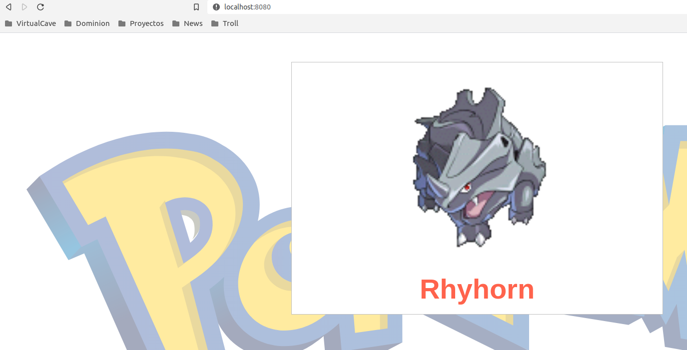

# Deployments

Kubernetes provides the [Deployment](https://kubernetes.io/docs/concepts/workloads/controllers/deployment/) object that allows to declare the management of Pods including upgrades strategies, rollbacks, or number of pods.

## Create a Deployment

Like in the Pods example, we can run the Deployment by execute the _kubectl_ command. 

```
$ kubectl run nginx --image=nginx --namespace=container-lab-ns

deployment.apps/nginx created
```

In this case, the default behavour is to run one Pod that we can confirm running the describe command. Where we can see the number of replicas for this Deployment.

```
$ kubectl describe deployment nginx -n container-lab-ns

Name:                   nginx
Namespace:              container-lab-ns
CreationTimestamp:      Tue, 20 Jul 2021 13:56:09 +0200
Labels:                 run=nginx
Annotations:            deployment.kubernetes.io/revision: 1
Selector:               run=nginx
Replicas:               1 desired | 1 updated | 1 total | 1 available | 0 unavailable
StrategyType:           RollingUpdate
MinReadySeconds:        0
RollingUpdateStrategy:  25% max unavailable, 25% max surge
Pod Template:
  Labels:  run=nginx
  Containers:
   nginx:
    Image:        nginx
    Port:         <none>
    Host Port:    <none>
    Environment:  <none>
    Mounts:       <none>
  Volumes:        <none>
Conditions:
  Type           Status  Reason
  ----           ------  ------
  Available      True    MinimumReplicasAvailable
  Progressing    True    NewReplicaSetAvailable
OldReplicaSets:  <none>
NewReplicaSet:   nginx-598b589c46 (1/1 replicas created)
Events:
  Type    Reason             Age    From                   Message
  ----    ------             ----   ----                   -------
  Normal  ScalingReplicaSet  3m20s  deployment-controller  Scaled up replica set nginx-598b589c46 to 1
```

Another useful operation we can run is the command GET with the output in yaml format. 

```
$ kubectl get deployment nginx -n container-lab-ns

NAME    READY   UP-TO-DATE   AVAILABLE   AGE
nginx   1/1     1            1           69m

$ kubectl get deployment nginx -n container-lab-ns -o yaml

apiVersion: apps/v1
kind: Deployment
metadata:
  annotations:
    deployment.kubernetes.io/revision: "1"
  creationTimestamp: "2021-07-20T11:56:09Z"
  generation: 1
  labels:
    run: nginx
  managedFields:
  - apiVersion: apps/v1
    fieldsType: FieldsV1
    fieldsV1:
      f:metadata:
        f:labels:
          .: {}
          f:run: {}
      f:spec:
        f:progressDeadlineSeconds: {}
        f:replicas: {}
        f:revisionHistoryLimit: {}
        f:selector: {}
        f:strategy:
          f:rollingUpdate:
            .: {}
            f:maxSurge: {}
            f:maxUnavailable: {}
          f:type: {}
        f:template:
          f:metadata:
            f:labels:
              .: {}
              f:run: {}
          f:spec:
            f:containers:
              k:{"name":"nginx"}:
                .: {}
                f:image: {}
                f:imagePullPolicy: {}
                f:name: {}
                f:resources: {}
                f:terminationMessagePath: {}
                f:terminationMessagePolicy: {}
            f:dnsPolicy: {}
            f:restartPolicy: {}
            f:schedulerName: {}
            f:securityContext: {}
            f:terminationGracePeriodSeconds: {}
    manager: kubectl
    operation: Update
    time: "2021-07-20T11:56:09Z"
  - apiVersion: apps/v1
    fieldsType: FieldsV1
    fieldsV1:
      f:metadata:
        f:annotations:
          .: {}
          f:deployment.kubernetes.io/revision: {}
      f:status:
        f:availableReplicas: {}
        f:conditions:
          .: {}
          k:{"type":"Available"}:
            .: {}
            f:lastTransitionTime: {}
            f:lastUpdateTime: {}
            f:message: {}
            f:reason: {}
            f:status: {}
            f:type: {}
          k:{"type":"Progressing"}:
            .: {}
            f:lastTransitionTime: {}
            f:lastUpdateTime: {}
            f:message: {}
            f:reason: {}
            f:status: {}
            f:type: {}
        f:observedGeneration: {}
        f:readyReplicas: {}
        f:replicas: {}
        f:updatedReplicas: {}
    manager: kube-controller-manager
    operation: Update
    time: "2021-07-20T11:56:11Z"
  name: nginx
  namespace: container-lab-ns
  resourceVersion: "264677"
  uid: ae8d5cac-5dcb-4001-954b-c7e6c48d06ea
spec:
  progressDeadlineSeconds: 600
  replicas: 1
  revisionHistoryLimit: 10
  selector:
    matchLabels:
      run: nginx
  strategy:
    rollingUpdate:
      maxSurge: 25%
      maxUnavailable: 25%
    type: RollingUpdate
  template:
    metadata:
      creationTimestamp: null
      labels:
        run: nginx
    spec:
      containers:
      - image: nginx
        imagePullPolicy: Always
        name: nginx
        resources: {}
        terminationMessagePath: /dev/termination-log
        terminationMessagePolicy: File
      dnsPolicy: ClusterFirst
      restartPolicy: Always
      schedulerName: default-scheduler
      securityContext: {}
      terminationGracePeriodSeconds: 30
status:
  availableReplicas: 1
  conditions:
  - lastTransitionTime: "2021-07-20T11:56:11Z"
    lastUpdateTime: "2021-07-20T11:56:11Z"
    message: Deployment has minimum availability.
    reason: MinimumReplicasAvailable
    status: "True"
    type: Available
  - lastTransitionTime: "2021-07-20T11:56:09Z"
    lastUpdateTime: "2021-07-20T11:56:11Z"
    message: ReplicaSet "nginx-598b589c46" has successfully progressed.
    reason: NewReplicaSetAvailable
    status: "True"
    type: Progressing
  observedGeneration: 1
  readyReplicas: 1
  replicas: 1
  updatedReplicas: 1
```

Now, let's clean all this and create a new Deployment with other image.

```
$ kubectl delete deployments.apps nginx -n container-lab-ns

deployment.apps "nginx" deleted
```

We will run a Deployment with three diferent replicas.

```
$ kubectl apply -f deployment-definitions/pokemon.yml

deployment.apps/pokemon-deployment created

$ kubectl get pods -n container-lab-ns

NAME                                  READY   STATUS    RESTARTS   AGE
pokemon-deployment-74f58f45db-hmsql   1/1     Running   0          3m34s
pokemon-deployment-74f58f45db-qbwrn   1/1     Running   0          3m34s
pokemon-deployment-74f58f45db-qsghw   1/1     Running   0          3m34s

$ kubectl describe deployment pokemon -n container-lab-ns

Name:                   pokemon-deployment
Namespace:              container-lab-ns
CreationTimestamp:      Tue, 20 Jul 2021 16:29:25 +0200
Labels:                 app=pokemon
Annotations:            deployment.kubernetes.io/revision: 1
                        kubectl.kubernetes.io/last-applied-configuration:
                          {"apiVersion":"apps/v1","kind":"Deployment","metadata":{"annotations":{},"labels":{"app":"pokemon"},"name":"pokemon-deployment","namespace...
Selector:               app=pokemon
Replicas:               3 desired | 3 updated | 3 total | 3 available | 0 unavailable
StrategyType:           RollingUpdate
MinReadySeconds:        0
RollingUpdateStrategy:  25% max unavailable, 25% max surge
Pod Template:
  Labels:  app=pokemon
  Containers:
   pokemon:
    Image:        ciberado/pokemon-nodejs
    Port:         80/TCP
    Host Port:    0/TCP
    Environment:  <none>
    Mounts:       <none>
  Volumes:        <none>
Conditions:
  Type           Status  Reason
  ----           ------  ------
  Available      True    MinimumReplicasAvailable
  Progressing    True    NewReplicaSetAvailable
OldReplicaSets:  <none>
NewReplicaSet:   pokemon-deployment-74f58f45db (3/3 replicas created)
Events:
  Type    Reason             Age    From                   Message
  ----    ------             ----   ----                   -------
  Normal  ScalingReplicaSet  4m13s  deployment-controller  Scaled up replica set pokemon-deployment-74f58f45db to 3
```

We have confirmed that the Pods of this deployment are running correctly. But we have not checked if they are affering the right content. Like in the Pods lab, we can execute the command _port-forward_ to run a bridge between our local environment and the Pod itself.

```
$ kubectl port-forward pokemon-deployment-74f58f45db-hmsql -n container-lab-ns 8080:80

Forwarding from 127.0.0.1:8080 -> 80
Forwarding from [::1]:8080 -> 80
Handling connection for 8080
Handling connection for 8080
```
And the result in the browser should be something like this.



In this case, for the next Lab we will keep this Deployment running. So you can go forward to [_Services_ lab.](../04-Services/README.md).