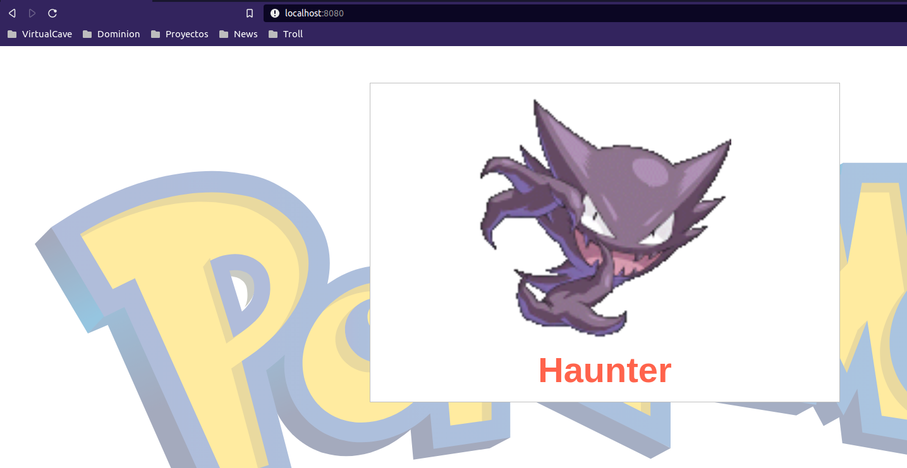

# Services

A [Service](https://kubernetes.io/docs/concepts/services-networking/service/) in Kubernetes is a way to expose a set of Pods and it will balance the requests between them.

There are [four different kind](https://kubernetes.io/docs/concepts/services-networking/service/#publishing-services-service-types) of Services that exposes the Pods in different scopes.

 - ClusterIP: Exposes the Service on a cluster-internal IP. Choosing this value makes the Service only reachable from within the cluster. This is the default.
 - NodePort: Exposes the Service on each Node's IP at a static port (the NodePort). A ClusterIP Service, to which the NodePort Service routes, is automatically created. You'll be able to contact the NodePort Service, from outside the cluster, by requesting <NodeIP>:<NodePort>.
 - LoadBalancer: Exposes the Service externally using a cloud provider's load balancer. NodePort and ClusterIP Services, to which the external load balancer routes, are automatically created.
 - ExternalName: Maps the Service to the contents of the externalName field (e.g. foo.bar.example.com), by returning a CNAME record with its value. No proxying of any kind is set up.

## Create a Service

We will expose the same Deployment than the previous lab. In this case we will create by default as ClusterIP. In this case the Pods will be only available from inside the cluster or by running the _port-forward_ command.

```
$ kubectl expose deployment pokemon-deployment --port=8080 --target-port=80 -n container-lab-ns

service/pokemon-deployment exposed

$ kubectl get services -n container-lab-ns

NAME                 TYPE        CLUSTER-IP     EXTERNAL-IP   PORT(S)    AGE
pokemon-deployment   ClusterIP   10.96.69.146   <none>        8080/TCP   13m

$ kubectl port-forward services/pokemon-deployment -n container-lab-ns 8080:8080

Forwarding from 127.0.0.1:8080 -> 80
Forwarding from [::1]:8080 -> 80
```
Like in the previous lab, we can check what it is exposing in the browser.



Now we can delete the Service to keep going with the lab.

```
$ kubectl delete service pokemon-deployment -n container-lab-ns

service "pokemon-deployment" deleted
```

## Create a Service using a definition

In this case we will create a NodePort service to test if the connectivity from outside the cluster is available. This should expose the port 30007 in the Cluster. In the case that your cluster runs in KinD, it will expose the port in the Docker container.

```
$ kubectl apply -f service-definitions/pokemon-service.yml

service/pokemon-service created

$ kubectl describe services pokemon-service -n container-lab-ns

Name:                     pokemon-service
Namespace:                container-lab-ns
Labels:                   <none>
Annotations:              kubectl.kubernetes.io/last-applied-configuration:
                            {"apiVersion":"v1","kind":"Service","metadata":{"annotations":{},"name":"pokemon-service","namespace":"container-lab-ns"},"spec":{"ports":...
Selector:                 app=pokemon
Type:                     NodePort
IP:                       10.96.207.192
Port:                     <unset>  8080/TCP
TargetPort:               80/TCP
NodePort:                 <unset>  30007/TCP
Endpoints:                10.244.0.12:80,10.244.0.13:80,10.244.0.14:80
Session Affinity:         None
External Traffic Policy:  Cluster
Events:                   <none>
```

As we said before, to test the Service in KinD, we will connect to the Docker container where is running the cluster.

```
$ docker ps

CONTAINER ID   IMAGE                  COMMAND                  CREATED      STATUS        PORTS                       NAMES
255a3808e1e7   kindest/node:v1.21.1   "/usr/local/bin/entr…"   2 days ago   Up 34 hours   127.0.0.1:38817->6443/tcp   container-lab-cluster-control-plane

$ docker exec -it 255a3808e1e7 sh

# curl localhost:30007
<!doctype html>
<html lang="en">
<head>
  <meta charset="UTF-8">
  <meta name="viewport" content="width=device-width">
  <title>Express</title>
  <link rel="stylesheet" href="/css/style.css">
    <script src="http://localhost:35729/livereload.js"></script>
</head>
<body>


  
<style>
    body {
      overflow: hidden;
    }
    #capsidelogo {
        position: absolute;
        right : 1em;
        bottom: 1em;
        width: 300px;
        padding: 0;
    }
    #version {
        position: absolute;
        left : 1em;
        bottom: 1em;
        width: 300px;
        padding: 0;
        font-size: 4em;
        font-weight: bold;
        color: silver;
    }
    
    #pokemonlogo {                
        position : absolute;
        width : 98%;
        margin : 0 auto;
        z-index : -10;
        opacity: 0.4;
    }
    
    .card {
        display : block;
        min-width: 420px;
        width : 40%;
        background-color : white;
        border : 1px solid silver;
        padding: 10px;
        margin : 0 auto;
        text-align : center;
    }
    
    .card > img {
        min-width : 400px;
    }
    
    .card h2 {
        margin : 8px;
        font-family : sans-serif;
        font-size : 4em;
        color : tomato;
    }

    .dangerousbutton {
        position : absolute;
        right: 1em;
        top : 0;
        margin-top: 2em;
        -moz-box-shadow: 0px 0px 2px 0px #c21b1b;
        -webkit-box-shadow: 0px 0px 2px 0px #c21b1b;
        box-shadow: 0px 0px 2px 0px #c21b1b;
        background-color:#cf293a;
        -moz-border-radius:12px;
        -webkit-border-radius:12px;
        border-radius:12px;
        border:1px solid #ab1919;
        display:inline-block;
        cursor:pointer;
        color:#ffffff;
        font-family:Arial;
        font-size:12px;
        padding:8px 16px;
        text-decoration:none;
    }
    .dangerousbutton:hover {
        background-color:#bd2a42;
    }
    .dangerousbutton:active {
        top:1px;
    }

</style>


<button type="button" class="dangerousbutton">Set one pokemon unhealthy</button>
<div class="card">
     
    <h2>Igglybuff</h2>
</div> 
<div id="version">0.0.3</div>

<script>
    document.querySelector('.dangerousbutton').addEventListener('click', function(evt) {
        this.innerHTML = 'Loading!';
        var xmlhttp = new XMLHttpRequest();

        xmlhttp.onreadystatechange = () => {
            if (xmlhttp.readyState == XMLHttpRequest.DONE) {   // XMLHttpRequest.DONE == 4
                if (xmlhttp.status == 200) {
                    this.innerHTML = 'Done';
                } else {
                    this.innerHTML = 'Error';
                }
            }
            setTimeout(() => this.remove(), 1000*2.5);
        };

        xmlhttp.open('DELETE', window.location.pathname + '/poison', true);
        xmlhttp.send();        
    }, false);

</script>


  </body>
</html>
```